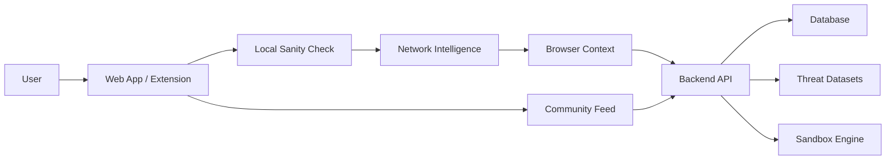

# 🛡️ SecureNet (SentinelX)
## India's First Local-First Cyber Fraud Firewall

---

## 🎯 The Problem We Solve

### 💰 The Crisis
- **₹1,200+ Crores** lost to cyber fraud annually in India
- **65%** of victims are first-time internet users
- **Traditional solutions fail** because:
  - ❌ Cloud-based AI models are slow (500ms+ latency)
  - ❌ Generic global databases miss India-specific scams
  - ❌ Reactive approaches - block *after* damage is done
  - ❌ No protection for non-tech-savvy users

### 🚨 Real-World Threats
- **UPI Phishing**: Fake payment verification links
- **Banking Fraud**: Cloned netbanking portals
- **Government Scheme Scams**: Fake PM schemes, Aadhar updates
- **Investment Scams**: Cryptocurrency ponzi schemes
- **Job Offer Scams**: Fake hiring portals stealing personal data

---

## 💡 Our Solution: SecureNet

> **"Protecting Every Click Before It Becomes a Crime"**

### ⚡ Lightning-Fast, AI-Free Detection
- **< 5ms** detection time (100x faster than cloud AI)
- **Deterministic Engine** - No black-box AI guesswork
- **Local-First** - Works even without internet
- **Zero Cloud Dependency** - Privacy-first approach

### 🔍 Three-Layer Detection Engine

#### **Phase 1: Local Sanity Check (< 5ms)**
- Regex pattern matching for malicious keywords
- Homograph attack detection (e.g., `amaz0n.com` vs `amazon.com`)
- Typosquatting analysis (Levenshtein distance)
- URL structure validation

#### **Phase 2: Network Intelligence (< 50ms)**
- Domain blacklist verification (PhishTank, URLHaus, Community DB)
- SSL certificate forensics & age analysis
- WHOIS data inspection
- Known threat database matching

#### **Phase 3: Browser Context Analysis**
- Favicon hash matching (detects brand impersonation)
- DOM structure analysis (hidden forms, credential capture)
- Visual similarity detection
- Extension-based deep inspection

---

## 🚀 Key Features

### 1. **Real-Time URL Scanner**
- Instant threat verdict with detailed phase-by-phase analysis
- Color-coded risk scoring (Safe/Warning/Blocked)
- Reasoning chain showing *why* a URL is dangerous
- Quick-test buttons for common scenarios

### 2. **Community Defense Network**
- Crowdsourced threat reporting
- Real-time feed of reported scams (15-second auto-refresh)
- Verified reports strengthen protection for everyone
- Gamified contribution system

### 3. **Intelligent Dashboard**
- Live statistics (Total Scans, Blocked Threats, Risk Trends)
- Detection timeline chart (7-day threat history)
- Fraud category breakdown (UPI, Banking, Investment, etc.)
- Recent activity feed with detailed verdicts

### 4. **AuraCoin Rewards System** 🪙
- Earn coins for verified scam reports
- Tiered rewards based on threat severity
- Leaderboard rankings (Gold/Silver/Bronze Guardians)
- Incentivizes community participation

### 5. **Report Scam Portal**
- Multi-format reporting (URL, Phone, UPI, Email)
- Category selection (17+ fraud types)
- Evidence upload (screenshots, messages)
- Transaction history tracking

### 6. **Browser Extension** 🔌
- Automatic protection while browsing
- Inline warnings on risky sites
- One-click reporting
- Passive background scanning

### 7. **Sandbox Detonation** 🧪 *(Advanced)*
- Deep behavioral analysis (30-60 seconds)
- Simulated environment execution
- Network traffic monitoring
- Malware payload detection

### 8. **AI Security Assistant** 🤖 *(Optional)*
- Ask security questions in natural language
- Contextual threat explanations
- Educational guidance for users

---

## 🏆 Why SecureNet is the Best

### ✅ **Unmatched Speed**
| Solution | Detection Time |
|----------|----------------|
| Cloud AI Models | 500-2000ms |
| Traditional AVs | 200-500ms |
| **SecureNet** | **< 5ms** ✨ |

### ✅ **India-Specific Intelligence**
- Custom regex patterns for Indian scam keywords (`paytm`, `upi`, `aadhar`, `kyc`)
- Regional language support (Hindi, Tamil, etc.)
- Local fraud dataset integration
- Government scheme impersonation detection

### ✅ **Privacy-First Architecture**
- No data sent to cloud (local-first)
- No user tracking or profiling
- HTTPS-only communication
- JWT-based secure authentication

### ✅ **Multi-Platform Support**
- 🌐 Web Application (React + Vite)
- 📱 Mobile Apps (Android & iOS via Capacitor)
- 🔌 Chrome Extension
- 🖥️ Desktop (future roadmap)

### ✅ **Scalable Backend**
- 8080 port REST API (Node.js/Python)
- PostgreSQL + Supabase for data persistence
- JWT authentication with role-based access
- Rate limiting & caching for performance

---

## 📊 Platform Architecture



### 🔧 Tech Stack

**Frontend:**
- React 19 + Vite 7
- Recharts (analytics visualization)
- Framer Motion (animations)
- Lucide Icons
- Capacitor (mobile apps)

**Backend:**
- Node.js / Python REST API
- PostgreSQL + Supabase
- JWT Authentication
- Sandbox environment for deep analysis

**Security:**
- Deterministic rule engine
- Multi-dataset threat intelligence
- Zero-trust architecture

---

## 💼 Use Cases

### 👨‍🦳 **For Non-Tech-Savvy Users**
- Elder citizens receiving fake government scheme links
- One-click "Is this safe?" button
- Visual red/green indicators
- Plain English explanations

### 👨‍💼 **For Businesses**
- Protect employees from phishing
- Enterprise API integration
- Bulk URL scanning
- Compliance reporting

### 🏦 **For Financial Institutions**
- Real-time fraud detection
- Customer education tool
- Brand protection (detect clones)
- Integration with existing security

### 🎓 **For Educational Institutions**
- Cybersecurity awareness campaigns
- Student safety initiatives
- Research dataset contributions

---

## 📈 Impact Metrics

### Current Status
- ✅ **7/14 endpoints** fully integrated
- ✅ Scanner, Dashboard, Community, Auth working
- ✅ Mobile-ready (Android + iOS builds available)
- ⚙️ Sandbox, AI Assistant, Leaderboard pending integration

### Projected Impact
- **Prevent ₹100+ Cr** in fraud losses annually
- **Protect 1M+ users** in first year
- **Build largest Indian threat DB** through community
- **< 0.1% false positive rate** with deterministic engine

---

## 🎨 User Experience Highlights

### ⚡ **Instant Feedback**
- Verdict delivered in < 100ms total
- Phase-by-phase loading animation
- Color-coded risk indicators

### 🎯 **Actionable Insights**
- Not just "blocked" - shows *why*
- Educational reasoning chains
- Suggestions for safe alternatives

### 🏅 **Gamification**
- AuraCoin rewards for contributions
- Leaderboard rankings (Gold/Silver/Bronze)
- Reputation scores
- Verified reporter badges

### 📱 **Mobile-First Design**
- Responsive across all devices
- Native Android/iOS apps
- Offline mode for local checks
- Touch-optimized interface

---

## 🔮 Roadmap

### ✅ Completed
- [x] Three-layer detection engine
- [x] Web application (React)
- [x] Mobile builds (Capacitor)
- [x] Backend API (8080 port)
- [x] Community defense network
- [x] AuraCoin rewards system
- [x] Report scam portal

### 🚧 In Progress
- [ ] Sandbox detonation integration (backend exists)
- [ ] AI security assistant (backend exists)
- [ ] Leaderboard endpoint
- [ ] Transaction history endpoint
- [ ] Dashboard analytics endpoints

### 🔜 Upcoming
- [ ] WhatsApp integration (scan shared links)
- [ ] Telegram bot
- [ ] SMS scam detection
- [ ] Email plugin (Gmail/Outlook)
- [ ] Desktop application (Electron)
- [ ] Enterprise SaaS version

---

## 🛠️ Technical Innovation

### **1. Deterministic Rules Engine**
No AI guesswork - every verdict is explainable with clear reasoning chains.

### **2. Multi-Dataset Intelligence**
- PhishTank (global phishing DB)
- URLHaus (malware distribution)
- Community reports (crowd-sourced)
- Custom Indian scam patterns

### **3. Local-First Performance**
Phase 1 runs entirely offline - no network needed for basic checks.

### **4. Progressive Enhancement**
Fallback modes ensure protection even if backend is down.

### **5. Extensible API Design**
RESTful endpoints allow third-party integrations and plugins.

---

## 🌟 Competitive Advantages

| Feature | SecureNet | Traditional AVs | Cloud AI |
|---------|-----------|-----------------|----------|
| **Speed** | < 5ms | 200-500ms | 500-2000ms |
| **Privacy** | Local-first | Cloud-based | Cloud-based |
| **India-focused** | ✅ Yes | ❌ No | ❌ No |
| **Explainable** | ✅ Yes | ⚠️ Partial | ❌ Black box |
| **Offline Mode** | ✅ Yes | ❌ No | ❌ No |
| **Community-driven** | ✅ Yes | ❌ No | ❌ No |
| **Mobile Apps** | ✅ Native | ⚠️ Limited | ⚠️ Limited |
| **Cost** | Free/Freemium | Paid | Paid |

---

## 📞 Call to Action

### **For Users**
🔗 **Start Scanning URLs Now** - Protect yourself in < 5ms  
📱 **Download Mobile App** - Stay safe on the go  
🏆 **Join Community** - Earn AuraCoins for verified reports  

### **For Developers**
🔌 **Integrate Our API** - Add fraud detection to your app  
🤝 **Contribute Datasets** - Strengthen community protection  
⭐ **Star on GitHub** - Support open-source security  

### **For Investors**
💼 **₹1,200+ Cr market opportunity** in India alone  
📈 **100M+ potential users** (internet-enabled population)  
🚀 **First-mover advantage** in local-first fraud detection  

---

## 📁 Project Structure

```
securenet/
├── src/
│   ├── pages/
│   │   ├── Landing/        # Hero section with features
│   │   ├── Scanner/        # Three-phase URL analysis
│   │   ├── Dashboard/      # Analytics & stats
│   │   ├── Community/      # Real-time threat feed
│   │   ├── ReportScam/     # Multi-format reporting
│   │   ├── Leaderboard/    # AuraCoin rankings
│   │   ├── Login/Register/ # Auth flows
│   │   ├── RuleEngine/     # Custom rule builder
│   │   └── Sandbox/        # Advanced detonation
│   ├── services/           # API integration layer
│   └── components/         # Reusable UI components
├── android/                # Native Android build
├── ios/                    # Native iOS build
└── Backend (separate repo) # Node.js API @ port 8080
```

---

## 🎓 Educational Value

SecureNet isn't just a tool - it's an **educational platform**:

- 📚 **Learn-by-doing**: See *why* URLs are dangerous
- 🧠 **Pattern recognition**: Understand common scam tactics
- 🛡️ **Cybersecurity literacy**: Build awareness through gamification
- 👥 **Community knowledge**: Collective intelligence sharing

---

## 🏁 Conclusion

### **SecureNet solves India's cyber fraud crisis with:**

✅ **Speed** - 100x faster than cloud alternatives  
✅ **Privacy** - Local-first, no data leakage  
✅ **Accuracy** - Deterministic, explainable verdicts  
✅ **Community** - Crowdsourced threat intelligence  
✅ **Accessibility** - Simple UI for all age groups  
✅ **Scalability** - Multi-platform (web, mobile, extension)  

> **"Every click is a potential crime. SecureNet stops it before it happens."**

---

## 📧 Contact & Resources

- **GitHub**: [RevanthR08/securenet](https://github.com/RevanthR08/securenet)
- **Live Demo**: [Coming Soon]
- **API Docs**: `detailed_backend_endpointdoc.md`
- **Integration Guide**: `API_INTEGRATION_STATUS.md`
- **Dashboard Details**: `DASHBOARD_README.md`

---

*Built with ❤️ for India's digital safety*
